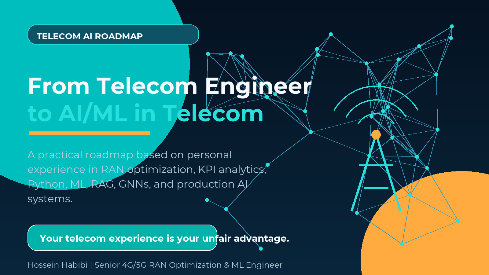

# From Telecom Engineer to AI/ML in Telecom

A practical roadmap for telecom engineers who want to move into AI/ML, based on the personal experience of Hossein Habibi.

## What this includes

This guide covers:

- why telecom domain knowledge is an advantage
- Python and ML foundations
- telecom data analytics
- first ML models for telecom
- deep learning for traffic forecasting
- graph ML for topology-aware intelligence
- NLP and RAG for telecom knowledge
- MLOps and production thinking
- a practical 6-month roadmap

## Live page

After enabling GitHub Pages, this repository can be viewed as a webpage.

## Author

**Hossein Habibi**  
Senior 4G/5G RAN Optimization & ML Engineer  
AI for Telecom RAN Intelligence

- LinkedIn: https://www.linkedin.com/in/hossein-habibi-749a56111/
- Portfolio: https://hosseinkavan.github.io/portfolio/
- Email: hossein.habibi.20120@gmail.com
